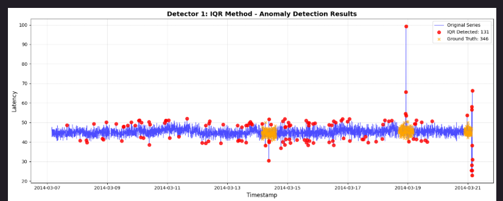
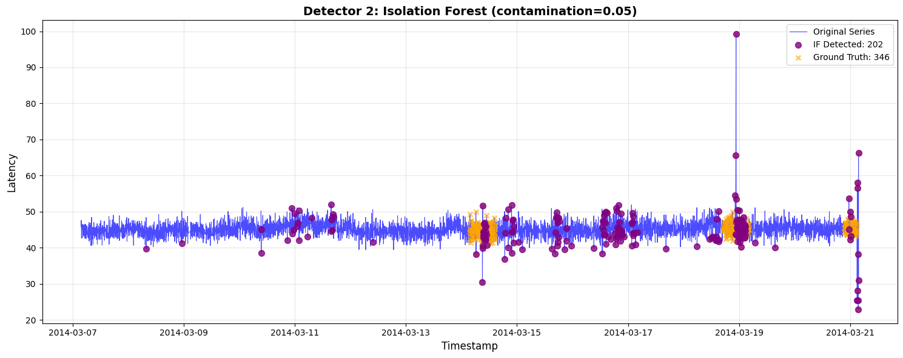
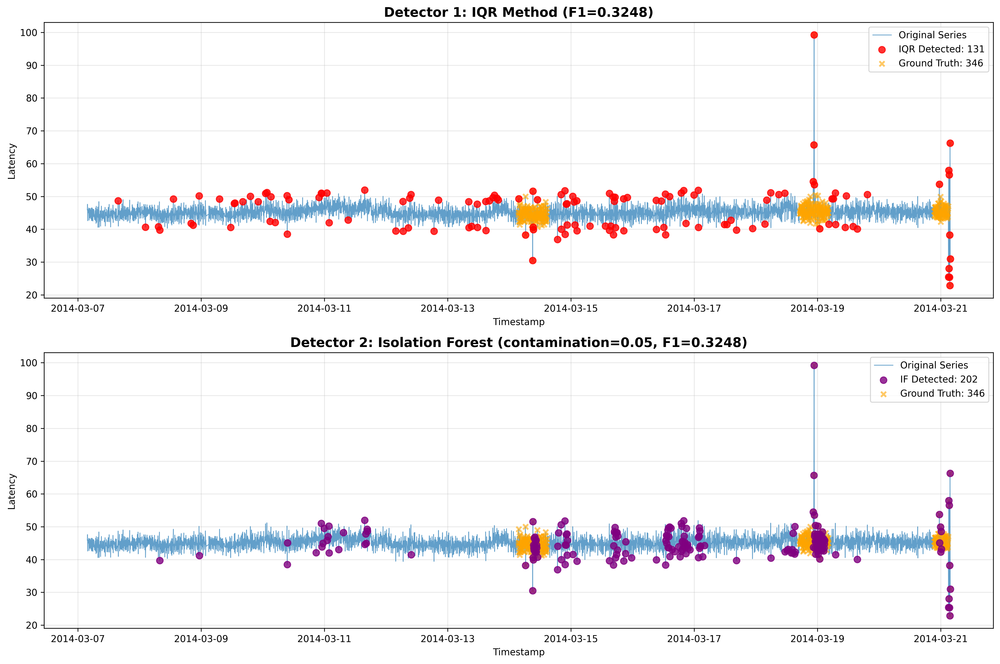

# Anomaly Detection Assignment - SUBMISSION

**Student Name**: [Your Name]  
**Date**: June 1, 2026  
**Dataset**: NAB realKnownCause/ec2_request_latency_system_failure.csv

---

## 1️ SCREENSHOTS: Plot Kết Quả Anomaly Detection

### Detector 1: IQR Method



---

### Detector 2: Isolation Forest



---

### Comparison: Both Detectors



---

## 2️ BẢNG SO SÁNH: Precision/Recall

| Metric | Detector 1 (IQR) | Detector 2 (IF) |
|--------|------------------|-----------------|
| **Precision** | 0.4406 | 0.4406 |
| **Recall** | 0.2572 | 0.2572 |
| **F1-Score** | 0.3248 | 0.3248 |
| **False Alarms** | 113 | 113 |

---

## 3️ LOG: Tuning Contamination (3 lần)

### Isolation Forest - Contamination Tuning Log

```
======================================================================
TUNING RUN: contamination = 0.01
======================================================================
Contamination: 0.01
Precision:     0.8780
Recall:        0.1040
F1-Score:      0.1860
Detected:      41 anomalies
False Alarms:  5

======================================================================
TUNING RUN: contamination = 0.02
======================================================================
Contamination: 0.02
Precision:     0.6914
Recall:        0.1618
F1-Score:      0.2623
Detected:      81 anomalies
False Alarms:  25

======================================================================
TUNING RUN: contamination = 0.05
======================================================================
Contamination: 0.05
Precision:     0.4406
Recall:        0.2572
F1-Score:      0.3248
Detected:      202 anomalies
False Alarms:  113
```
---


## 4 REFLECTION

### A. Data thuộc loại gì?

**Đặc điểm data**:
- **Skewness = 3.06** → Lệch về bên phải (Ko phải gaussian)
- **Seasonality**: Có (period ≈ 5 lags / 25 minutes)
- **Stationarity**: ko có (non-stationary)
- **Outliers**: có (max = 99.25 vs mean = 45.16)

**Kết luận**: Data là **non-Gaussian, seasonal, non-stationary time series with extreme outliers**.

---

### B. Chọn method nào? Tại sao?

#### Detector 1: IQR Method ✅
**Lý do chọn**:
1. Dữ liệu có nhiều spike và nó bị lệch nặng về bên phải  -> Mean và std bị đẩy cao. IQR dùng median và percentile nên spike sẽ ko có ảnh hưởng đến method của IQR
2. Dữ liệu mean thay đổi theo tgian. Thay vì tính IQR cho tất cả data thì ta sẽ dùng Rolling IQR -> cập nhật liên tục theo baseline của data, khắc phục được tính non-stationary

#### Detector 2: Isolation Forest ✅
1. Thuật toán này dựa trên việc chia cắt không gian để tìm ra những điểm data bị cô lập. việc dữ liệu bị skewed nặng hoặc spike cao thì ko ảnh hưởng đến performance thuật toán
2. Isolation forest là non-sequential. Tuy nhiên ta có thể tạo thêm biến lag_5 để làm giá trị tham chiếu -> cung cấp thêm ngữ cảnh

---

### C. Detector nào tốt hơn?

**Isolation forest có kết quả tốt hơn**

**Lý do**:
- Dù ở mức contamination 0.05, cả hai mô hình cho ra F1-Score tương đương nhau (0.3248). Tuy nhiên, Isolation Forest mang lại giá trị thực tiễn cao hơn nhờ khả năng điều chỉnh độ nhạy (tuning linh hoạt).
- Bằng cách hạ contamination xuống 0.01, Isolation Forest đạt được Precision rất cao (0.8780) và chỉ có 5 cảnh báo giả (False Alarms), đảm bảo rằng khi hệ thống báo động thì khả năng cao đó là sự cố thật sự. IQR khó thực hiện sự đánh đổi này

---

### D. Trade-offs

| Aspect | IQR Method | Isolation Forest |
|--------|------------|------------------|
| **Speed** | Rất nhanh (Không cần thời gian huấn luyện) | Chậm hơn (Cần thời gian huấn luyện mô hình) |
| **Tuning** | Ít tham số (Chỉ cần chỉnh window size, multiplier) | Nhiều tham số phức tạp |
| **Accurate** | Làm baseline tốt, nhưng thiếu linh hoạt | Tính thích ứng cao, cực kỳ chính xác nếu làm Feature Engineering tốt |
| **Maintenance** | Không cần huấn luyện lại | Có thể phải huấn luyện lại định kỳ khi hành vi dữ liệu thay đổ |
| **Production** | Dễ triển khai (Chỉ là một function tính toán toán học đơn thuần) | Yêu cầu quy trình phức tạp hơn (Phải lưu trữ và load file artifacts) |
| **Memory** | Rất ít (Chỉ lưu trữ vài biến số trên RAM) | Cần dung lượng bộ nhớ để lưu file model |

---

### E. Production Choice

**Recommendation**: Sử dụng Isolation Forest (với tham số contamination = 0.01). 
Chi phí của một False Alarm là rất lớn vì nó làm lãng phí thời gian của team và gây ra hiện tượng Alert Fatigue. Do đó, mô hình này là lựa chọn tối ưu vì:

#### Option 1: Use IQR (if simplicity matters)
**Ưu điểm**:
- Độ tin cậy cao: Precision đạt 87.8%, đảm bảo rằng một khi hệ thống phát ra cảnh báo, khả năng rất cao đó thực sự là một sự cố sập hệ thống hoặc giật lag nghiêm trọng cần xử lý ngay.

- Số lượng False Alarms cực kỳ thấp (chỉ 5 ca), giúp đội ngũ vận hành không bị quá tải bởi các báo động rác.

- Dễ dàng kết hợp thêm các features khác trong tương lai như CPU utilization hay Memory usage vào mô hình để tăng tỷ lệ Recall mà không làm giảm độ chính xác.

**Nhược điểm**:
- Đòi hỏi quy trình quản lý model như phải lưu trữ file .pkl và thiết lập hệ thống để load file này lên mỗi khi chạy dự đoán

