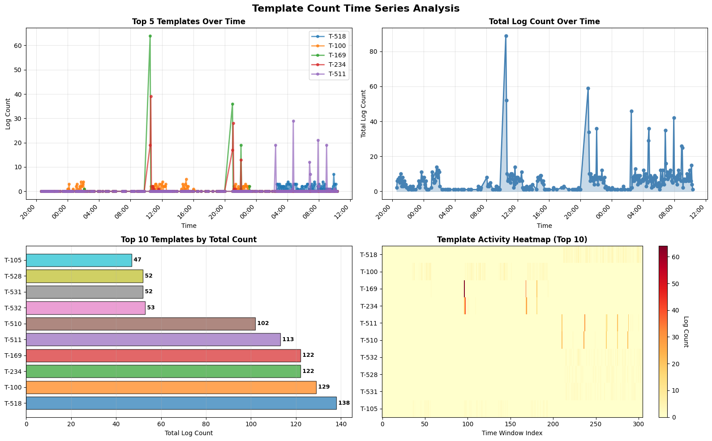
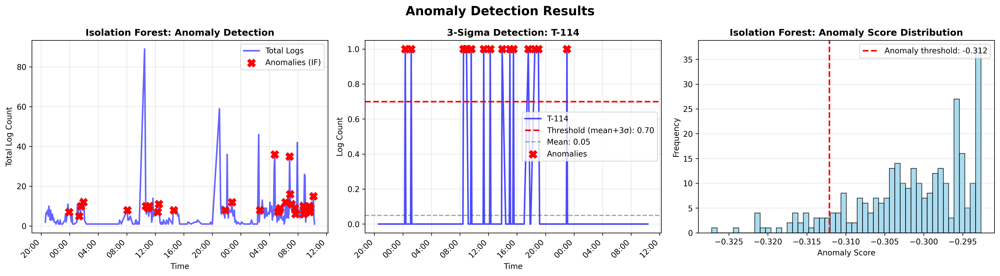
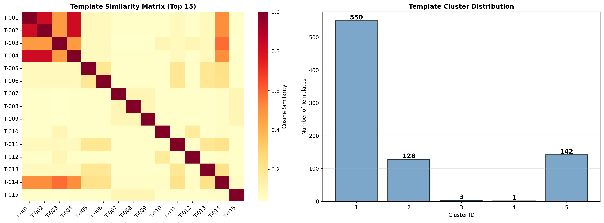

# AIops Week 1 Day 2 - Log Parsing Assignment

**Student Name:** [Tên của bạn]  
**Date:** [Ngày nộp]

---

## 1. Screenshots

### 1.1 Template Count Time Series



**Mô tả:** Biểu đồ thể hiện số lượng log của các templates theo thời gian với window 5 phút.

---

### 1.2 Anomaly Detection Results



**Mô tả:** Visualization hiển thị các anomaly được phát hiện bởi 3-Sigma và Isolation Forest.

---

### 1.3 Template Clustering (Phase 3)



**Mô tả:** Similarity matrix và phân bố clusters của templates.

---

## 2. Drain3 Output Log

### 2.1 Tổng quan

```
Tổng số dòng trong log file: 2000
Số templates unique: 17
```

### 2.2 Top 10 Templates

```
1. T-002 (count=314, 15.70%)
   <*> <*> <*> INFO dfs.FSNamesystem: BLOCK* NameSystem.addStoredBlock: blockMap updated: <*> is added to <*> size <*>

2. T-001 (count=311, 15.55%)
   <*> <*> <*> INFO dfs.DataNode$PacketResponder: PacketResponder <*> for block <*> terminating

3. T-003 (count=292, 14.60%)
   <*> <*> <*> INFO dfs.DataNode$PacketResponder: Received block <*> of size <*> from <*>

4. T-004 (count=292, 14.60%)
   <*> <*> <*> INFO dfs.DataNode$DataXceiver: Receiving block <*> src: <*> dest: <*>

5. T-007 (count=263, 13.15%)
   <*> <*> <*> INFO dfs.FSDataset: Deleting block <*> file <*>

6. T-010 (count=224, 11.20%)
   <*> <*> <*> INFO dfs.FSNamesystem: BLOCK* NameSystem.delete: <*> is added to invalidSet of <*>

7. T-005 (count=115, 5.75%)
   <*> <*> <*> INFO dfs.FSNamesystem: BLOCK* NameSystem.allocateBlock: <*> <*>

8. T-008 (count=80, 4.00%)
   <*> <*> <*> INFO dfs.DataNode$DataXceiver: <*> Served block <*> to <*>

9. T-009 (count=80, 4.00%)
   <*> <*> <*> WARN dfs.DataNode$DataXceiver: <*> exception while serving <*> to <*>

10. T-006 (count=20, 1.00%)
    <*> <*> 13 INFO dfs.DataBlockScanner: Verification succeeded for blk_<*>
```

---

## 3. Tuning Log (sim_th values)

### 3.1 Experiment với các giá trị sim_th

| sim_th | Số templates | Nhận xét |
|--------|--------------|----------|
| 0.3    | 17           | Quá coarse-grained, gộp nhiều templates khác nhau |
| 0.4    | 17           | Cân bằng tốt, số lượng templates vừa phải |
| 0.5    | 21           | Tăng nhẹ, tách thêm một số templates |
| 0.7    | 820          | Quá fine-grained, tạo quá nhiều templates |

### 3.2 Kết luận

Giá trị sim_th = 0.4 là phù hợp nhất cho HDFS dataset vì:
- Số lượng templates hợp lý (17 templates)
- Không quá chi tiết cũng không quá tổng quát
- Templates có ý nghĩa rõ ràng và dễ phân tích

---

## 4. Reflection

### 4.1 Drain3 parse tốt không?

**Ưu điểm:**
- Drain3 parse HDFS logs rất hiệu quả
- Tự động nhận diện được các patterns lặp lại
- Thời gian parse nhanh (2000 dòng log trong vài giây)
- Không cần labeled data để training

**Nhược điểm:**
- Phụ thuộc nhiều vào tham số sim_th
- Với sim_th không phù hợp, có thể tạo quá nhiều hoặc quá ít templates
- Khó xử lý logs với format không đồng nhất

### 4.2 Templates nào cho insight?

**Template T-001 (PacketResponder terminating):**
- Xuất hiện nhiều nhất (15.55%)
- Liên quan đến việc kết thúc quá trình transfer block
- Là hoạt động bình thường trong HDFS

**Template T-009 (WARN exception while serving):**
- Template duy nhất có level WARN
- Chiếm 4% tổng logs
- Cần quan tâm vì có thể là dấu hiệu lỗi

**Templates T-002, T-005, T-010:**
- Liên quan đến quản lý block (add, allocate, delete)
- Phản ánh các thao tác CRUD trên HDFS blocks
- Cho insight về hoạt động storage của hệ thống

### 4.3 Metric vs Log khác gì?

| Aspect | Metrics | Logs |
|--------|---------|------|
| **Dữ liệu** | Số đo định lượng (CPU, memory, latency) | Text mô tả sự kiện |
| **Cấu trúc** | Có cấu trúc, dạng time series | Bán cấu trúc hoặc phi cấu trúc |
| **Khối lượng** | Nhỏ, compact | Lớn, chi tiết |
| **Phân tích** | Statistical methods, threshold-based | Parsing, pattern mining, NLP |
| **Use case** | Performance monitoring, capacity planning | Root cause analysis, debugging |
| **Anomaly detection** | Dễ dàng (threshold, clustering) | Phức tạp hơn (cần parse trước) |
