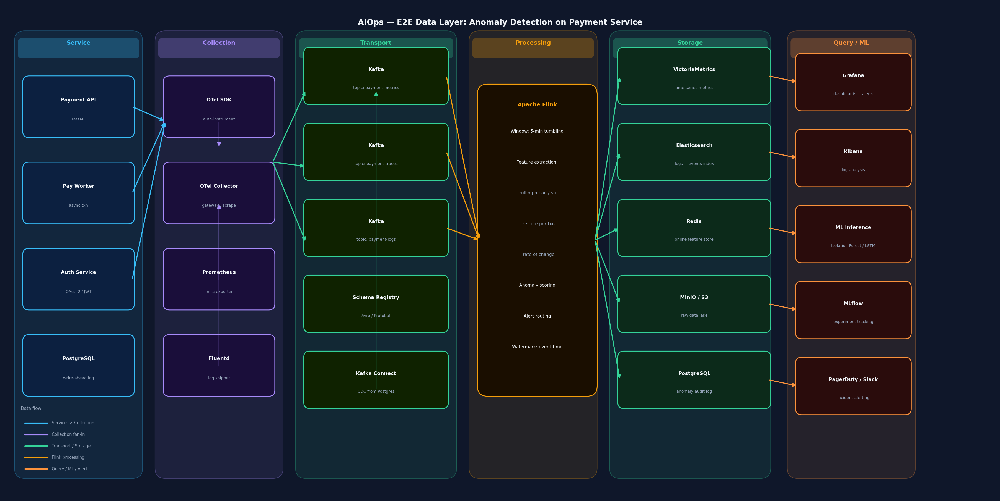

# SUBMIT.md — W1/D3: AIOps Data Architecture

**Student:** Nguyen Ngoc Giao  
**Use case:** Anomaly Detection on Payment Service  
**Stack:** OTel SDK → Kafka → Apache Flink → VictoriaMetrics + Elasticsearch + Redis → Grafana + MLflow

---

## 1. Architecture Diagram



**Data flow (trái → phải):**

```
Payment API
    └─ OTel SDK ──► OTel Collector ──► Kafka (metrics / traces / logs)
                                              │
                                       Apache Flink
                                       (5-min window, z-score)
                                              │
                   ┌──────────────┬──────────┴──────────┬─────────────┐
            VictoriaMetrics  Elasticsearch            Redis          S3
                   │               │                    │
                Grafana          Kibana          ML Inference ──► PagerDuty
```

---

## 2. Cost Estimate

> Số liệu từ `cost_model.py` — AWS on-demand, us-east-1, 730 h/tháng.  
> SaaS = Datadog (Infrastructure Pro $46/host + Log Management $1.50/GB).

```
==========================================================================================
BẢNG ƯỚC TÍNH CHI PHÍ OBSERVABILITY HÀNG THÁNG
==========================================================================================
  Tier  Services Storage ($) Compute ($) Kafka ($) TOTAL BUILD ($) TOTAL SaaS ($) Diff
 Small        10        $358        $120      $250            $728         $2,710 3.7x
Medium       100      $3,575      $1,200      $250          $5,025        $27,100 5.4x
 Large      1000     $35,750     $12,000    $2,500         $50,250       $271,000 5.4x
==========================================================================================
```

**Đọc bảng:**
- **Storage** = VictoriaMetrics (metrics) + Elasticsearch (logs, 30-day) + S3 (cold archive 90-day)
- **Compute** = Flink cluster + OTel Collector nodes
- **Kafka** = Broker cluster (minimum $250/mo cho 3-node HA)
- **TOTAL BUILD** = self-managed trên AWS
- **TOTAL SaaS** = Datadog list price, không có enterprise discount
- **Diff** = Datadog đắt hơn bao nhiêu lần

---

## 3. ADR-001 Summary — Self-Managed vs Datadog

**Decision:** Chọn **self-managed stack** (Build).

**Tóm tắt lý do:**

| Yếu tố | Build | Datadog |
|--------|-------|---------|
| Chi phí (Medium tier) | ~$5,000/mo | ~$27,100/mo |
| Alert latency | < 5 giây (Flink) | 30–120 giây (SaaS batching) |
| Data sovereignty | Toàn bộ trong VPC | Data ra external server |
| PCI-DSS compliance | Sạch hơn | Cần DPA riêng với vendor |
| Vendor lock-in | Không (OTel chuẩn) | Cao (proprietary agent) |
| Ops burden | 2 SRE dedicated | 0.1 FTE (chỉ config) |

**Trade-off chính:** Tiết kiệm ~$22,000/tháng ở Medium tier (≈ $264K/năm), đủ để hire 2 senior engineers vận hành stack. Đổi lại phải chịu bootstrapping 8–12 tuần và on-call burden.

**Alternatives đã loại:** Datadog full, Hybrid (DD APM + self ES), Grafana Cloud.

## 4. Reflection

**Câu hỏi:** Nếu được hire làm Platform Engineer cho startup 50-service vừa raise Series A, bạn recommend **build hay buy**?

**Trả lời: Buy trước, plan để build sau 12–18 tháng.**

Lý do không phải vì build tệ — mà vì **timing và opportunity cost**.

Startup vừa raise Series A đang ở giai đoạn cần tốc độ hơn tất cả. Engineer giỏi ở giai đoạn này nên đang build product, không phải đang debug Kafka broker hay tune Elasticsearch heap size. Mỗi tuần SRE bỏ ra để vận hành observability stack là một tuần không ship feature — và với runway hậu Series A thường 18–24 tháng, đó là chi phí thực sự cao nhất, dù không hiện ra trong bill hàng tháng.

Cụ thể với 50 services, Datadog cost ước tính khoảng **$5,800–$8,000/tháng** (50 × $46 infra/APM + ~500 GB log/day × $1.50). Con số đó nghe có vẻ lớn, nhưng nếu đổi lại team khỏi cần 1 SRE dedicated (~$12,000–15,000/tháng fully-loaded ở mức senior), thì **Datadog thực ra rẻ hơn**. Và 1 SRE đó có thể build thứ quan trọng hơn.

1. **Instrument chuẩn OpenTelemetry** từ ngày đầu — không dùng Datadog SDK proprietary. Điều này đảm bảo khi quyết định migrate, không phải re-instrument toàn bộ codebase.

2. **Set trigger rõ ràng để review lại:** Khi Datadog bill vượt $15,000/tháng (tương đương 1 FTE cost), hoặc team có SRE thứ 2, ngồi lại đánh giá migrate sang self-managed.


