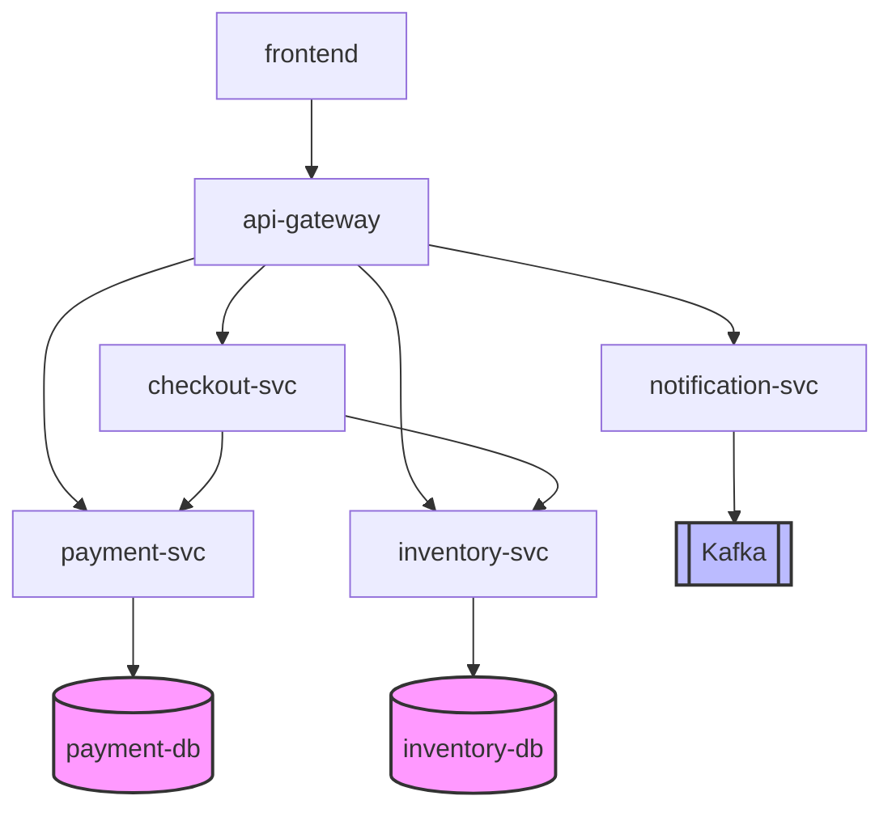

# Chaos Engineering — Fault Injection để Validate AIOps Pipeline

> [!NOTE]
> **Tài liệu học tập & Hướng dẫn thực hành**  
> **AIOps Week 3** — Reliability Engineering & Postmortem (W3-D2)

---

## Table of Contents

- [1. Định nghĩa](#1-định-nghĩa)
- [2. 5 Nguyên tắc cốt lõi](#2-5-nguyên-tắc-cốt-lõi)
- [3. Fault categories](#3-fault-categories)
  - [3.1 Network faults](#31-network-faults)
  - [3.2 Resource faults](#32-resource-faults)
  - [3.3 Application faults](#33-application-faults)
  - [3.4 State faults](#34-state-faults)
- [4. Tool landscape](#4-tool-landscape)
- [5. Experiment design template](#5-experiment-design-template)
  - [5.1 Hypothesis viết đúng](#51-hypothesis-viết-đúng)
  - [5.2 Blast radius escalation](#52-blast-radius-escalation)
- [6. Measurement framework cho AIOps pipeline](#6-measurement-framework-cho-aiops-pipeline)
  - [6.1 Confusion matrix per experiment](#61-confusion-matrix-per-experiment)
  - [6.2 RCA accuracy](#62-rca-accuracy)
  - [6.3 Scoreboard sau N experiment](#63-scoreboard-sau-n-experiment)
  - [6.4 External steady-state signal — synthetic probes](#64-external-steady-state-signal--synthetic-probes)
- [7. Pipeline failure modes — observed in real incidents](#7-pipeline-failure-modes---observed-in-real-incidents)
  - [7.1 Detector miss: anomaly chìm dưới noise floor](#71-detector-miss-anomaly-chìm-dưới-noise-floor)
  - [7.2 Correlator false positive: gộp fault độc lập thành 1 incident](#72-correlator-false-positive-gộp-các-lỗi-không-liên-quan-thành-một-incident)
  - [7.3 RCA wrong root: pick service ồn nhất, không phải gốc](#73-rca-wrong-root-pick-service-ồn-nhất-không-phải-gốc)
  - [7.4 LLM hallucination với confidence cao](#74-llm-hallucination-với-confidence-cao)
  - [7.5 Monitoring dependency loop](#75-monitoring-dependency-loop)
- [8. Bài tập](#8-bài-tập)
  - [8.1 Setup được cung cấp](#81-setup-được-cung-cấp)
  - [8.2 Bước 1 — Capture baseline + start synthetic probe](#82-bước-1--capture-baseline--start-synthetic-probe)
  - [8.3 Bước 2 — Experiment catalog](#83-bước-2--experiment-catalog)
  - [8.4 Bước 3 — Fill experiments.yaml](#84-bước-3--fill-experimentsyaml)
  - [8.5 Bước 4 — Implement chaos_runner.py](#85-bước-4--implement-chaos_runnerpy)
  - [8.6 Bước 5 — Chạy 10 experiment + score](#86-bước-5--chạy-10-experiment--score)
  - [8.7 Bước 6 — Viết chaos_report.md](#87-bước-6--viết-chaos_reportmd)
  - [8.8 Bước 7 — SUBMIT.md](#88-bước-7--submitmd)
  - [8.9 Acceptance checklist](#89-acceptance-checklist)
- [9. Anti-patterns](#9-anti-patterns)
- [10. References](#10-references)

---

## 1. Định nghĩa

**Chaos Engineering** là một kỷ luật thực nghiệm có chủ đích bằng cách inject fault (tiêm lỗi) vào hệ thống phân tán (distributed system) để khám phá các điểm yếu (weakness) trước khi các lỗi đó xảy ra một cách tự nhiên trên môi trường Production.

### Phân biệt Chaos Engineering với các thực hành khác

| Thực hành | Mục tiêu | Khi nào chạy |
| :--- | :--- | :--- |
| **Unit test** | Xác minh code chạy đúng đặc tả kỹ thuật (spec) | CI/CD pipeline |
| **Load test** | Xác minh hệ thống chịu được mức tải dự kiến | Pre-launch, định kỳ |
| **Penetration test** | Tìm kiếm các lỗ hổng bảo mật | Hằng quý (Quarterly) |
| **Chaos engineering** | Tìm kiếm điểm yếu về độ tin cậy (reliability weakness) phát sinh từ tương tác giữa các component | Continuously, trên môi trường giống Production |

> *Source: Casey Rosenthal et al., Principles of Chaos Engineering, principlesofchaos.org (2017, refined 2019).*

---

## 2. 5 Nguyên tắc cốt lõi

*Theo [principlesofchaos.org](https://principlesofchaos.org/):*

1. **Build a hypothesis around steady-state behavior**
   * Định nghĩa trạng thái hệ thống ổn định ("system OK") bằng các metric có thể đo lường được trước khi inject fault.
2. **Vary real-world events**
   * Inject fault mô phỏng các sự cố thực tế: crash instance, tăng network latency, dependency timeout, v.v.
3. **Run experiments in production**
   * Môi trường Staging không thể tái hiện chính xác quy mô và đặc điểm traffic của Production. Chỉ có prod-chaos mới phát hiện được các class of bug sinh ra do scale.
4. **Automate experiments to run continuously**
   * Kiểm thử chaos thủ công (ví dụ 1 lần/quý) là không đủ tin cậy. Cần tự động hóa chaos để kiểm thử liên tục.
5. **Minimize blast radius**
   * Bắt đầu thử nghiệm ở phạm vi nhỏ nhất có thể (1 instance, 1% traffic) rồi tăng dần. Đảm bảo có cơ chế rollback đủ nhanh khi gặp sự cố ngoài dự kiến.

---

## 3. Fault categories

Có 4 lớp fault chính, dưới đây là công cụ và cơ chế chuẩn cho mỗi lớp:

### 3.1 Network faults

| Fault | Mechanism | Tool |
| :--- | :--- | :--- |
| **Latency injection** | `tc netem delay 500ms ± 100ms` | Pumba, Chaos Mesh, Toxiproxy |
| **Packet loss** | `tc netem loss 30%` | Pumba netem, Chaos Mesh NetworkChaos |
| **Bandwidth throttle** | `tc tbf rate 1mbit` | Pumba |
| **Partition (split-brain)** | `iptables -A INPUT -s X -j DROP` | Chaos Mesh partition, Pumba |
| **DNS slow/fail** | Override resolver | Toxiproxy, Chaos Mesh DNSChaos |

### 3.2 Resource faults

| Fault | Mechanism | Tool |
| :--- | :--- | :--- |
| **CPU stress** | `stress-ng --cpu 4 --cpu-load 90` | Pumba stress, Chaos Mesh StressChaos |
| **Memory fill** | `stress-ng --vm 1 --vm-bytes 80%` | Chaos Mesh, Litmus pod-memory-hog |
| **Disk I/O saturation** | `dd if=/dev/zero of=/tmp/file bs=1M` | Chaos Mesh IOChaos |
| **Disk fill** | Fill volume to 95% | Litmus disk-fill |
| **File descriptor exhaustion** | Open N file descriptors | Custom script |

### 3.3 Application faults

| Fault | Mechanism | Tool |
| :--- | :--- | :--- |
| **Pod/container kill** | `docker kill`, `kubectl delete pod` | Chaos Monkey, Pumba kill, Litmus pod-delete |
| **Pause (SIGSTOP)** | Đóng băng tiến trình mà không làm crash | Pumba pause |
| **HTTP error inject** | Proxy injects 5xx response | Toxiproxy, Chaos Mesh HTTPChaos |
| **HTTP slow response** | Proxy delays response | Toxiproxy |
| **Exception injection** | Bytecode rewrite | Byteman (JVM), Failify |

### 3.4 State faults

| Fault | Mechanism | Tool |
| :--- | :--- | :--- |
| **Clock skew** | `libfaketime`, `chrony` manipulation | Chaos Mesh TimeChaos |
| **Time jump** | `date -s` (tiến hoặc lùi thời gian) | Chaos Mesh TimeChaos |
| **Config corruption** | Thay thế config file bằng file lỗi | Custom script |
| **Cache poisoning** | Inject bad data vào Redis/Memcached | Custom script |

---

## 4. Tool landscape

| Tool | Vendor | Scope | License | Strengths | Limits |
| :--- | :--- | :--- | :--- | :--- | :--- |
| **Chaos Monkey** | Netflix | EC2 / Cloud instance | Apache 2.0 | Pioneer, đơn giản | Instance-only |
| **Pumba** | Alexei Ledenev | Docker | MIT | CLI đơn giản, không cần infra phức tạp | Chỉ dùng cho Docker, không hỗ trợ K8s |
| **Chaos Mesh** | PingCAP / CNCF | Kubernetes | Apache 2.0 | CRD-driven, dashboard trực quan, đa dạng fault | Chỉ hỗ trợ K8s |
| **LitmusChaos** | MayaData / CNCF | Kubernetes | Apache 2.0 | Thư viện experiment ChaosHub lớn, tích hợp CI/CD | Chỉ hỗ trợ K8s |
| **Toxiproxy** | Shopify | Network proxy | MIT | Deterministic, framework-agnostic, thân thiện cho test | Chỉ can thiệp ở network layer |
| **Gremlin** | Gremlin Inc | Multi-platform | Commercial | Enterprise UI, kiểm soát an toàn tốt, ALFI | Closed-source, trả phí |
| **AWS FIS** | AWS | AWS workloads | AWS service | Tích hợp sâu với AWS console & IAM | Chỉ chạy trên AWS |
| **Azure Chaos Studio**| Microsoft | Azure workloads | Azure service | Tích hợp hệ sinh thái Azure | Chỉ chạy trên Azure |

### Sơ đồ cây quyết định chọn Tool (Decision Tree):
```text
Môi trường triển khai của bạn là gì?
├── Chỉ sử dụng Docker (dev/local) ──> Pumba
├── Kubernetes (K8s)
│   ├── Cần tích hợp CI/CD ──> LitmusChaos
│   ├── Cần Dashboard trực quan & nhiều loại fault ──> Chaos Mesh
│   └── Đơn giản nhất ──> Chaos Monkey cho K8s
├── Cần test Network deterministic (ở tầng code/app) ──> Toxiproxy
├── Cloud-managed
│   ├── AWS ──> AWS FIS
│   └── Azure ──> Azure Chaos Studio
└── Enterprise, có ngân sách lớn ──> Gremlin
```

---

## 5. Experiment design template

Mẫu cấu trúc một thử nghiệm bắt buộc gồm 5 trường chính *(theo Rosenthal & Jones, Chaos Engineering, O’Reilly 2020)*:

```yaml
experiment:
  name: "Payment service network partition under load"
  hypothesis: |
    Steady-state: order_success_rate >= 99.5%, checkout_p99 <= 800ms.
    Khi payment-svc bị partition khỏi checkout-svc, retry logic
    sẽ failover sang backup payment provider trong vòng < 30 giây, 
    giúp order_success_rate không giảm quá 5% trong 60 giây tiếp theo.
  blast_radius:
    target: 1 instance của payment-svc
    traffic: 10% production traffic (canary cell)
    duration: 60 seconds
  rollback:
    automatic: true
    trigger_when: order_success_rate < 90% OR checkout_p99 > 3s
    method: iptables flush, restart sidecar
  measurement:
    metrics: [order_success_rate, checkout_p99, payment_retry_count, error_log_rate]
    capture_window: t-5min to t+10min
  abort_conditions:
    - Bất kỳ vi phạm SLO vượt quá budget trong vòng 30s
    - Alert Tier-1 được kích hoạt
```

### 5.1 Hypothesis viết đúng
* **Sai (vague/mơ hồ):** *"Hệ thống vẫn hoạt động bình thường khi gặp lỗi."*
* **Đúng (testable/đo lường được):** `order_success_rate >= 99.5%, p99 latency <= 800ms trong suốt 60s bị network partition.`

### 5.2 Blast radius escalation
Khi thử nghiệm ở giai đoạn trước thành công (pass), hãy mở rộng dần dần:

```text
[Stage 1: Dev] ──> [Stage 2: Staging] ──> [Stage 3: Prod Canary] ──> [Stage 4: Prod Region] ──> [Stage 5: Prod Global]
```

* **Stage 1 (Dev):** Chạy trên 1 single container ở local. Tải giả lập (synthetic).
* **Stage 2 (Staging):** Chạy trên full staging stack kèm load test.
* **Stage 3 (Prod Canary):** Chạy trên 1 instance, ảnh hưởng 1-10% traffic thực tế.
* **Stage 4 (Prod Region):** Chạy trên 1 region, ảnh hưởng 25-100% traffic khu vực.
* **Stage 5 (Prod Global):** Chạy trên toàn bộ hệ thống (Game Day).

> [!WARNING]
> Không bỏ qua các stage. Nếu stage trước thất bại (fail), lập tức **Dừng lại (Stop)**, **Sửa lỗi (Fix)**, và **Chạy lại (Retry)**.

---

## 6. Measurement framework cho AIOps pipeline

Mục tiêu chính của Chaos trong lab này là xác minh xem **AIOps Pipeline** (gồm Detector, Correlator, RCA) có phát hiện và định danh chính xác các fault đã tiêm hay không.

### 6.1 Confusion matrix per experiment

| | Pipeline reported incident (Báo có lỗi) | Pipeline silent (Không báo lỗi) |
| :--- | :--- | :--- |
| **Fault injected (Thực tế có lỗi)** | **TP** (True Positive - Phát hiện đúng) | **FN** (False Negative - Bỏ lọt lỗi) |
| **No fault (Trạng thái bình thường)** | **FP** (False Positive - Cảnh báo giả) | **TN** (True Negative - Im lặng đúng) |

Các metric đánh giá hiệu năng của Pipeline:
* **Precision** (Độ chính xác của cảnh báo):
  $$\text{Precision} = \frac{\text{TP}}{\text{TP} + \text{FP}}$$
* **Recall** (Tỷ lệ phát hiện lỗi):
  $$\text{Recall} = \frac{\text{TP}}{\text{TP} + \text{FN}}$$

### 6.2 RCA accuracy

Đánh giá xem module RCA có chỉ ra đúng dịch vụ gốc gây ra lỗi (root cause) hay không:

| | RCA chỉ đúng root service | RCA chỉ sai root service | RCA không cho ra kết quả |
| :--- | :---: | :---: | :---: |
| **Fault tại Service A** | $RCA_{\text{correct}}$ | $RCA_{\text{wrong}}$ *(ví dụ chọn nhầm downstream)* | $RCA_{\text{miss}}$ |

* **RCA Accuracy**:
  $$\text{RCA Accuracy} = \frac{RCA_{\text{correct}}}{\text{TP}}$$

### 6.3 Scoreboard sau N experiment

| Experiment | Detected | MTTD | RCA correct | False alarms |
| :--- | :---: | :---: | :---: | :---: |
| payment latency +500ms | Y | 47s | Y | 0 |
| db kill | Y | 12s | N *(picked api)* | 0 |
| cache cpu 90% | N | — | — | — |
| network partition | Y | 23s | Y | 1 |
| ... | ... | ... | ... | ... |
| **TOTAL** | **8/10 detected** | **MTTD p50: 25s** | **RCA Acc: 75%** | **FP: 1** |

### 6.4 External steady-state signal — synthetic probes

Thay vì chỉ tin vào metric nội bộ của hệ thống (Prometheus metrics có thể bị trễ hoặc bị lỗi), hãy dùng **External Blackbox Probe** — một tiến trình độc lập chạy bên ngoài cluster, gọi liên tục endpoint của người dùng để ghi nhận trạng thái pass/fail.

#### So sánh Internal Metric vs External Synthetic Probe:

| Tiêu chí | Internal Metric (Prometheus scrape) | External Synthetic Probe |
| :--- | :--- | :--- |
| **Đo lường gì** | Hệ thống tự khai báo là "OK" | Người dùng thực tế trải nghiệm có "OK" không |
| **Dễ bị đánh lừa bởi** | Phản hồi 200 nhưng body rỗng/lỗi, cache bị stale | Khó bị lừa vì đo trực tiếp kết quả phản hồi cuối |
| **Chứng minh user impact** | Gián tiếp (phải suy luận từ chỉ số hệ thống) | Trực tiếp (Probe đóng vai trò như client/user thực) |
| **Các lỗi phát hiện được** | Service crash, slow query | Phát hiện thêm: DNS, TLS, Ingress, LB, WAF misconfig |

#### Ví dụ Script Probe đơn giản (20 dòng bash):

```bash
#!/usr/bin/env bash
# synthetic_probe.sh — log trạng thái pass/fail mỗi 5s làm steady-state signal
ENDPOINT="${1:-http://localhost:8080/checkout/health}"
LOG="${2:-probe.log}"

while true; do
  ts=$(date -u +%s)
  start=$(date +%s%N)
  code=$(curl -s -o /dev/null -w "%{http_code}" --max-time 2 "$ENDPOINT")
  end=$(date +%s%N)
  latency_ms=$(( (end - start) / 1000000 ))
  
  if [[ "$code" == "200" && "$latency_ms" -lt 500 ]]; then
    echo "$ts pass $latency_ms" >> "$LOG"
  else
    echo "$ts fail $code $latency_ms" >> "$LOG"
  fi
  sleep 5
done
```

> **Steady-state tiêu chuẩn:** Tỷ lệ thành công $\ge 99\%$ pass trong cửa sổ 60 giây.
> * **Trước khi inject:** Chạy probe trong 5 phút để xác nhận hệ thống ổn định (steady-state).
> * **Trong khi inject:** Đánh giá mức độ ảnh hưởng (user impact) thông qua độ sụt giảm pass-rate.
> * **Sau khi rollback:** Đảm bảo pass-rate quay lại mức $\ge 99\%$ trong vòng 2 phút (hệ thống phục hồi hoàn toàn).

#### Gotcha — Vị trí đặt Probe quyết định lỗi phát hiện được:

| Vị trí đặt Probe | Phát hiện được | Bỏ sót (Miss) |
| :--- | :--- | :--- |
| **Cùng Pod** | Pod logic crash | Network, Load Balancer, Ingress, DNS |
| **Cùng Cluster** | + kube-dns, internal LB | External LB, CDN, WAN |
| **Ngoài Cluster, cùng Region** | + Ingress, SSL Cert, public DNS | Inter-region routing, CDN edge |
| **Multi-region external** | Sát với trải nghiệm của user thật | Chi phí vận hành cao, dễ bị ảnh hưởng bởi internet flap |

---

## 7. Pipeline failure modes — observed in real incidents

### 7.1 Detector miss: anomaly chìm dưới noise floor
* *Ví dụ từ sự cố Roblox (Tháng 10/2021 - sập 73 tiếng):* Lỗi tranh chấp tài nguyên (contention) của Consul streaming không kích hoạt cảnh báo trễ (latency alert) vì baseline latency của Consul vốn đã biến động mạnh. Bộ dò tìm bất thường dựa trên $3\sigma$ (3 độ lệch chuẩn) đã nâng ngưỡng cảnh báo lên gấp 50 lần bình thường, khiến cho mức tăng bất thường thực tế (chỉ gấp 5 lần) bị bỏ qua.
* **Giải pháp:** Sử dụng phân tích bất thường dựa trên phân vị (percentile-based anomaly) trên chỉ số $p99$ thay vì sử dụng giá trị trung bình (mean), hoặc phân tách baseline theo múi giờ (cao điểm vs thấp điểm).

### 7.2 Correlator false positive: gộp fault độc lập thành 1 incident
* Khi 2 lỗi hoàn toàn độc lập xảy ra cùng lúc (ví dụ: Deploy Bug ở Service A + Network Blip ở Service B trong cùng 5 phút), bộ tương quan (Correlator) dựa trên thời gian sẽ gộp chúng thành 1 sự cố duy nhất. RCA sau đó chỉ chọn được 1 dịch vụ làm root cause gây sai lệch thông tin.
* **Giải pháp:** Tích hợp bộ tương quan nhận diện cấu trúc liên kết mạng (topology-aware correlation) dựa trên bản đồ phụ thuộc (dependency graph), không chỉ dựa vào thời gian (temporal).

### 7.3 RCA wrong root: pick service ồn nhất, không phải gốc
* *Hiện tượng Retry Storm:* `payment-svc` bị lỗi $\rightarrow$ `checkout-svc` kích hoạt cơ chế thử lại (retry) 10 lần $\rightarrow$ `checkout` bắn ra 10 cảnh báo. Một thuật toán RCA cơ bản nếu xếp hạng theo số lượng alert sẽ chọn ngay `checkout-svc`.
* **Giải pháp:** Sử dụng giải pháp Topology-aware kết hợp phân tích trễ nhân quả (Granger causality, cross-correlation lag analysis) để tìm dịch vụ xuất hiện lỗi đầu tiên ở phía thượng nguồn (upstream).

### 7.4 LLM hallucination với confidence cao
* Các mô hình ngôn ngữ lớn (LLM) hỗ trợ RCA đôi khi phân tích ra nguyên nhân rất hợp lý nhưng sai sự thật với độ tự tin $0.9+$.
* **Giải pháp:** Áp dụng **grounded confidence** (chỉ cho phép điểm tin cậy cao khi có đầy đủ bằng chứng đính kèm như metric anomaly, log signature, topology distance). Từ chối kết quả (reject) nếu phần trích dẫn minh chứng bị rỗng.

### 7.5 Monitoring dependency loop
* *Sự cố Roblox 2021:* Hệ thống monitoring được vận hành trên hạ tầng của Consul. Khi Consul sập, hệ thống monitoring không thể bắn cảnh báo $\rightarrow$ AIOps không nhận được dữ liệu đầu vào $\rightarrow$ Hệ thống mù thông tin hoàn toàn.
* **Giải pháp:** Hệ thống AIOps và Observability cần chạy trên một phân vùng hạ tầng độc lập, hoàn toàn tách biệt với các dịch vụ đang được giám sát.

---

## 8. Bài tập

### 8.1 Setup được cung cấp

Tải Starter Pack:
```bash
wget https://learning-notes-dz2.pages.dev/aiops-w3/lab/w3-d2-pack.zip
unzip w3-d2-pack.zip -d w3-d2-pack/
cd w3-d2-pack/
cat README.md
```

#### Cấu trúc thư mục Starter Pack:
* `README.md` — Hướng dẫn tích hợp hệ thống.
* `experiments_template.yaml` — File cấu hình mẫu cho 10 thí nghiệm (cần hoàn thiện các mục từ 2 đến 9).
* `synthetic_probe.sh` — Script kiểm tra trạng thái dịch vụ bên ngoài (§6.4).
* `pipeline/chaos_runner_skeleton.py` — File khung của runner chứa 2 hàm cần code thêm (§8.5).
* `configs/prometheus_targets.yml` — Cấu hình giám sát mẫu cho Prometheus.
* `scripts/`
  * `start_stack.sh` — Khởi động các container Docker Compose.
  * `capture_baseline.py` — Chụp thông số baseline của Prometheus trong vòng 5 phút (300 giây).
  * `query_pipeline.py` — Giao tiếp API của AIOps `/alerts`, `/correlate`, `/rca`.
  * `score_run.py` — Tính toán scoreboard từ kết quả chaos_results.json.

> [!IMPORTANT]
> **Starter Pack không bao gồm:** Hệ thống microservices (10 services) và AIOps Pipeline FastAPI. Bạn cần tái sử dụng lại source code và file docker-compose từ bài thực hành trước đó (W2 Lab C) và bổ sung thêm dịch vụ để đủ 10 dịch vụ theo mô hình bên dưới.

#### Bản đồ phụ thuộc dịch vụ (Service Topology Target):



* **Dịch vụ bổ sung phụ trợ:** `auth-svc`, `log-collector`, `dns-resolver`, `cache-svc`.
* **Hạ tầng giám sát:** Prometheus v2.50, Grafana v10.4, Alertmanager v0.27.
* **AIOps Pipeline API** (FastAPI chạy trên Port 8000):
  * `GET  /alerts?since=<ts>` $\rightarrow$ Lấy danh sách alert đã kích hoạt.
  * `POST /correlate {window}` $\rightarrow$ Nhóm các cảnh báo theo cụm sự cố.
  * `POST /rca {cluster}` $\rightarrow$ Trả về kết quả phân tích nguyên nhân gốc `{root_service, confidence, evidence}`.

### 8.1 Setup được cung cấp (Trùng tiêu đề gốc)

*Chi tiết cấu trúc Starter Pack đã được liệt kê ở trên.*

### 8.2 Bước 1 — Capture baseline + start synthetic probe

```bash
# Đợi các service khởi động hoàn tất và khỏe mạnh (health check OK)
bash scripts/start_stack.sh

# Chụp thông số baseline của Prometheus trong vòng 5 phút (300 giây)
python scripts/capture_baseline.py --duration 300 --out baseline.json

# Chạy probe giám sát liên tục ở chế độ chạy ngầm (background)
nohup bash synthetic_probe.sh http://localhost:8080/checkout/health probe.log &
echo $! > probe.pid
```

> [!WARNING]
> Đảm bảo pass-rate của `probe.log` đạt $\ge 99\%$ trong vòng 60 giây trước khi chuyển sang Bước 2. Nếu không, hệ thống của bạn chưa thực sự ổn định.

### 8.3 Bước 2 — Experiment catalog

| # | Target (Đối tượng) | Fault (Lỗi tiêm vào) | Kết quả mong đợi từ AIOps Pipeline |
| :--- | :--- | :--- | :--- |
| **1** | `payment-svc` | netem delay +500ms | Phát hiện bất thường trễ (latency), RCA chỉ ra `payment-svc`. |
| **2** | `payment-svc` | netem loss 30% | Phát hiện bất thường tỷ lệ lỗi (error_rate), RCA chỉ ra `payment-svc`. |
| **3** | `inventory-svc` | pod kill mỗi 60 giây | Phát hiện bất thường về độ sẵn sàng (availability), RCA chỉ ra `inventory-svc`. |
| **4** | `api-gateway` | Stress CPU 90% | Phát hiện tăng độ trễ diện rộng trên toàn bộ các downstream service. |
| **5** | `payment-db` | Chiếm dụng RAM (memory fill 95%)| Phát hiện lỗi cạn kiệt connection pool, RCA chỉ ra `payment-db`. |
| **6** | `auth-svc` | Lệch múi giờ hệ thống +60s | Phát hiện lỗi xác thực Token/JWT hoặc TLS Cert, RCA chỉ ra `auth-svc`. |
| **7** | `log-collector` | Tràn đĩa cứng (disk fill 95%) | Phát hiện hiện tượng trễ ghi nhận log (log ingestion lag). |
| **8** | `frontend ↔ api-gateway` | Network partition hoàn toàn 30s | Phát hiện lỗi timeout diện rộng, RCA chỉ ra biên kết nối (edge/gateway). |
| **9** | `dns-resolver` | DNS lookup chậm +2s | Phát hiện lỗi kết nối chập chờn, kết quả RCA phụ thuộc vào Topology. |
| **10**| `checkout-svc` | Tiêm mã lỗi HTTP 500 (tỷ lệ 20%) | Mô phỏng Retry Storm. RCA **không được phép** chỉ ra `checkout-svc` làm root cause mà phải chỉ ra phía downstream bị lỗi gốc. |

> [!NOTE]
> Giữa mỗi thử nghiệm cần có khoảng thời gian nghỉ (**cooldown**) tối thiểu **120 giây** để hệ thống tự phục hồi về trạng thái baseline ban đầu.

### 8.4 Bước 3 — Fill experiments.yaml

Sao chép file mẫu: `experiments_template.yaml` sang `experiments.yaml`. Điền đầy đủ thông tin cho các thử nghiệm từ 2 đến 9 theo đúng cấu trúc chuẩn của thử nghiệm 1 và 10 đã được cấu hình sẵn.

### 8.5 Bước 4 — Implement chaos_runner.py

Sao chép `pipeline/chaos_runner_skeleton.py` sang `chaos_runner.py` và hoàn thiện 2 hàm `TODO`:
1. `build_inject_cmd(exp)`: Nhận thông tin cấu hình lỗi từ file yaml, sinh ra câu lệnh CLI tương ứng (sử dụng các công cụ Pumba, Toxiproxy, iptables, stress-ng, v.v.) và thực thi thông qua `subprocess.run`.
2. `print_scoreboard(results)`: Hàm xử lý dữ liệu đầu ra và in ra màn hình bảng Scoreboard đúng theo định dạng chuẩn ở mục 8.6.

### 8.6 Bước 5 — Chạy 10 experiment + score

Chạy script thực thi tự động:
```bash
python chaos_runner.py
```

#### Yêu cầu định dạng đầu ra của Scoreboard:
```text
==== Chaos Run ====
Total: 10
Detected: <N>/10
RCA correct: <N>/<detected>
False alarms in baseline windows: <N>
Precision: <float>
Recall: <float>
MTTD p50: <s>, p95: <s>

Per-experiment:
| # | name              | detected | mttd  | rca_service  | rca_correct |
|---|-------------------|----------|-------|--------------|-------------|
| 1 | payment_latency   | Y        | 28s   | payment-svc  | Y           |
| 2 | ...               | ...      | ...   | ...          | ...         |

Gaps identified:
- <experiment id>: <symptom> -> <suspected root cause in pipeline>
```

#### Tiêu chí nghiệm thu (Acceptance Criteria):
* **Tỷ lệ phát hiện lỗi (Recall):** $\ge 7/10$ ($70\%$)
* **Độ chính xác RCA (RCA Accuracy):** $\ge 5/7$ trong số các lỗi được phát hiện ($\sim 70\%$)
* **Cảnh báo giả (False Alarm) trong Baseline window:** $\le 1$

> [!IMPORTANT]
> Nếu không đạt tiêu chuẩn nghiệm thu, bạn hãy ghi nhận chi tiết các điểm yếu vào báo cáo Gap Analysis (§8.7). Tuyệt đối **không được hardcode** hoặc chỉnh sửa pipeline một cách thiếu trung thực để vượt qua bài test.

### 8.7 Bước 6 — Viết chaos_report.md

Báo cáo bắt buộc phải có 4 phần chính sau:
1. **Setup:** Chi tiết phiên bản code (commit hash), thời gian chụp baseline, tổng số thí nghiệm đã chạy.
2. **Results table:** Copy nội dung bảng Scoreboard đã chạy ở mục 8.6 vào đây.
3. **Detailed per-experiment analysis:** Phân tích chi tiết từng thí nghiệm (từ 80 - 150 từ mỗi mục): Nêu hypothesis, kết quả thực tế (detected/RCA), giải thích lý do nếu lệch kỳ vọng.
4. **Gap analysis — top 3 pipeline weakness:** Liệt kê Top 3 điểm yếu lớn nhất của Pipeline (Symptom, Suspected cause, Recommended fix).
5. **Hypothesis cho gap chưa khẳng định** *(Không bắt buộc)*.

### 8.8 Bước 7 — SUBMIT.md

Nội dung nộp bài bắt buộc điền theo form sau:

```markdown
# W3-D2 Submission — <Họ và tên của bạn>

## 3 thứ tôi học được về AIOps pipeline của mình
1. ...
2. ...
3. ...

## 1 fault mà tôi mong pipeline catch nhưng nó miss
- Experiment: ...
- Why I expected detection: ...
- Why pipeline missed (hypothesis): ...

## 1 trade-off trong design pipeline mà tôi muốn rethink
...

## Scoreboard summary
- detected: __/10
- rca_correct: __/__
- mttd_p50: __s
- false_alarms: __
- verdict: [PASS/FAIL]
```

### 8.9 Acceptance checklist
- [ ] File `experiments.yaml` đầy đủ 10 thử nghiệm với 5 trường bắt buộc.
- [ ] File `chaos_runner.py` chạy ổn định, tự động hóa hoàn toàn không có tham số hard-code.
- [ ] Xuất file kết quả `chaos_results.json` đầy đủ thông tin 10 lần chạy.
- [ ] Đính kèm file `probe.log` (ghi nhận steady-state liên tục) trong thư mục nộp bài.
- [ ] Định dạng Scoreboard hiển thị chuẩn xác.
- [ ] Đạt các chỉ số tối thiểu: Detected $\ge 7$, RCA Correct $\ge 5$, FA $\le 1$.
- [ ] Có đầy đủ file báo cáo `chaos_report.md` và `SUBMIT.md` đúng template.

---

## 9. Anti-patterns

* **Inject fault không có hypothesis rõ ràng:** Dễ dẫn đến phá hỏng hệ thống một cách vô nghĩa và không rút ra được bài học kỹ thuật nào.
* **Tiêm lỗi thẳng lên Production khi chưa chạy Staging:** Dễ gây ra sự cố mất an toàn hệ thống (outage thật).
* **Quên viết script tự động thu hồi lỗi (rollback script):** Làm lỗi bị treo vĩnh viễn trên hệ thống và buộc đội ngũ vận hành phải can thiệp thủ công.
* **Chỉ đo lường trạng thái "hệ thống còn sống" (health check 200):** Bỏ qua các sự cố âm thầm (silent failure) hoặc suy giảm hiệu năng một phần (partial degradation).
* **Bỏ qua quy trình mở rộng phạm vi (blast radius escalation):** Nhảy thẳng từ thử nghiệm local sang thử nghiệm quy mô lớn dễ gây thảm họa.
* **Thực hiện chaos theo kỳ hạn dài mà không tích hợp liên tục:** Cấu hình hệ thống sẽ thay đổi liên tục theo thời gian, thử nghiệm gián đoạn sẽ nhanh chóng bị lạc hậu.
* **Chỉ tiêm lỗi đơn lẻ:** Các sự cố thực tế thường là sự kết hợp phức tạp của nhiều lỗi đồng thời (Ví dụ: lỗi Roblox là sự kết hợp của streaming traffic + nghẽn database BoltDB).
* **Không lưu vết phiên bản của cấu hình thí nghiệm:** Làm mất khả năng tái hiện lỗi để phục vụ việc debug sau này.

---

## 10. References

* **Principles of Chaos Engineering:** [principlesofchaos.org](https://principlesofchaos.org/)
* **Chaos Engineering (O'Reilly 2020):** Rosenthal & Jones, [O'Reilly Library](https://www.oreilly.com/library/view/chaos-engineering/9781492043860/)
* **Netflix Tech Blog — ChAP:** [Chaos Automation Platform](https://netflixtechblog.com/chap-chaos-automation-platform-53e6d528371f)
* **Roblox postmortem (Consul + BoltDB):** [Roblox Return to Service Report](https://about.roblox.com/newsroom/2022/01/roblox-return-to-service-10-28-10-31-2021)
* **Pumba (Docker Chaos Tool):** [github.com/alexei-led/pumba](https://github.com/alexei-led/pumba)
* **Chaos Mesh:** [chaos-mesh.org](https://chaos-mesh.org/)
* **LitmusChaos:** [litmuschaos.io](https://litmuschaos.io/)
* **Toxiproxy (Network Chaos):** [github.com/Shopify/toxiproxy](https://github.com/Shopify/toxiproxy)
* **AWS FIS:** [aws.amazon.com/fis](https://aws.amazon.com/fis)
* **Azure Chaos Studio:** [learn.microsoft.com/azure/chaos-studio](https://learn.microsoft.com/azure/chaos-studio)
* **Google SRE Workbook Chapter 5 — Black-box Monitoring:** [sre.google/workbook/monitoring/](https://sre.google/workbook/monitoring/)
* **k6.io (Load + Synthetic testing):** [k6.io](https://k6.io/)
* **Grafana Synthetic Monitoring:** [grafana.com/products/cloud/synthetic-monitoring/](https://grafana.com/products/cloud/synthetic-monitoring/)
